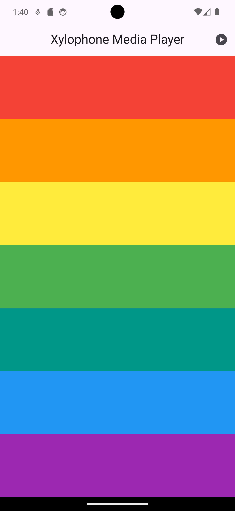

# xylophone_media_player

A simple Flutter app that simulates a xylophone with 7 keys.  
This project also includes a WebView to open YouTube in mobile view.

---

## Features

- 7 colorful xylophone keys (hard-coded)
- Play sounds for each key using `audioplayers`
- Navigate to YouTube mobile view using `webview_flutter`
- Clean, modern UI
- No complex state management required

---

## Screenshots




---

## Getting Started

### Prerequisites

- Flutter SDK installed
- Android Studio or VS Code
- Developer Mode enabled on Windows (required for plugins)

### Run the App

1. Clone or download this repository
2. Move the project to a folder 
3. Install dependencies:

```bash
flutter pub get
